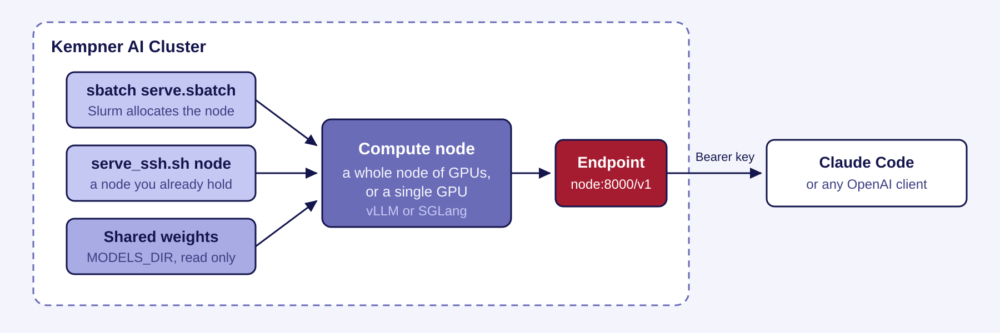

# HPC Agentic Recipes

Recipes for serving open-weight models on the Kempner AI Cluster and driving them with Claude Code or any
OpenAI-compatible client.

Both vLLM and SGLang are used here, and both serve an Anthropic-compatible endpoint that Claude Code talks
to directly. vLLM runs most recipes. SGLang runs Kimi-K3 from a container. See
[docs/engines.md](docs/engines.md).



The engine runs on a compute node, not where you type. Everything below is either pointing a client at an
endpoint someone already started, or starting one yourself.

## Connect to a running endpoint

Set five variables:

```
export ANTHROPIC_BASE_URL=http://<node>:8000
export ANTHROPIC_AUTH_TOKEN=<the api key>
export ANTHROPIC_MODEL=<served model name>
export ANTHROPIC_SMALL_FAST_MODEL=<the same name>
export CLAUDE_CODE_ATTRIBUTION_HEADER=0
claude
```

> [!IMPORTANT]
> Use `ANTHROPIC_AUTH_TOKEN`, not `ANTHROPIC_API_KEY`. The latter sends an `x-api-key` header, which both
> engines ignore, so every request returns 401.

Get the served model name from the endpoint:

```
curl -s -H "Authorization: Bearer $ANTHROPIC_AUTH_TOKEN" http://<node>:8000/v1/models
```

Walkthrough in [docs/quickstart.md](docs/quickstart.md).

## Serve a model

`uv` has to be on your PATH before any recipe builds, because it installs the Python environment. An RTX
recipe also needs `mamba`, which installs the CUDA toolkit; the H200 and H100 recipes do not use it. On this
cluster `mamba` comes from a module:

```
module load Mambaforge
command -v uv || curl -LsSf https://astral.sh/uv/install.sh | sh
```

> [!WARNING]
> Run the build on a compute node, never a login node. It downloads and unpacks about 12 GB across tens of
> thousands of files.

First create an API key. The name is the recipe path with a hyphen, so `recipes/GLM-5.2-NVFP4/rtx-8` reads:

```
mkdir -p secrets
printf '%s' "sk-local-$(openssl rand -hex 24)" > secrets/GLM-5.2-NVFP4-rtx-8.key
chmod 600 secrets/GLM-5.2-NVFP4-rtx-8.key
```

Every runnable recipe names its file at the top of its README. `secrets/vllm_api_key` is read when that file is
absent, so a single key there still gates everything.

With a key in place, requests without it receive HTTP 401. `secrets/` is gitignored. To rotate, replace the
file and restart: the engine reads it once at launch.

Then start with a single-GPU recipe, which needs one GPU rather than a whole node and so queues fastest:
[recipes/gemma-4-26B-A4B-it/h200-1](recipes/gemma-4-26B-A4B-it/h200-1/README.md). Follow it from the top.
Runnable recipes all have the same steps: configure once, build the environment, launch, verify, connect.

Each launches two ways: an sbatch submission and a direct launch on nodes you already hold. Every sbatch
submission needs `--account=<your-account>`. The direct launch does not go through Slurm and needs none.

To choose a model, see [docs/choosing-a-model.md](docs/choosing-a-model.md). The fastest model here is not
the best coder.

## Models

Rows are grouped by model, one per hardware configuration, and the hardware cell links to that recipe.
Rates for the vLLM recipes are measured with `common/tools/bench.sh` and Kimi-K3 with the same protocol
under SGLang; method in [docs/benchmarking.md](docs/benchmarking.md). `c=256` means 256 concurrent
requests. `Context` is what the recipe serves by default and `MAX_MODEL_LEN` changes it, but not every
recipe can reach its checkpoint maximum: where one request that long needs more KV cache than the hardware
has, the engine refuses to start. Each recipe states its own ceiling in Known limits.

| Model | Precision | Hardware | 1xStream<br>tok/s | Aggregate<br>tok/s / c | Context |
| --- | --- | --- | --- | --- | --- |
| **GLM-5.2** | NVFP4 | [1 RTX node](recipes/GLM-5.2-NVFP4/rtx-8) | 91.1 | 1375/256 ⛰️ | 212K |
| | FP8 | [2 H200 nodes](recipes/GLM-5.2-FP8/h200-4-nodes2) | 68.9 | 5606/512 ⛰️ | 626K |
| **GLM-4.6** | FP8 | [1 H200 node](recipes/GLM-4.6-FP8/h200-4) | 19.1 | 8127/1024 📈 | 198K |
| **Kimi-K2.7-Code** | INT4 | [1 RTX node](recipes/Kimi-K2.7-Code/rtx-8) | 20.6 | 1833/896 ➖ | 128K |
| | INT4 | [2 H200 nodes](recipes/Kimi-K2.7-Code/h200-4-nodes2) | 30.2 | 7094/1024 📈 | 256K |
| **Kimi-K3** | MXFP4 QAT | [4 H200 nodes](recipes/Kimi-K3/h200-4-nodes4-sglang) | 40.3 | 1067/64 🚧 | 374K |
| **Qwen3-235B-A22B** | BF16 | [1 RTX node](recipes/Qwen3-235B-A22B/rtx-8) | 62.7 | 3948/512 ⛰️ | 40K |
| **Qwen3-Coder-480B** | FP8 | [1 RTX node](recipes/Qwen3-Coder-480B-A35B-Instruct-FP8/rtx-8) | 68.0 | 3197/640 ⛰️ | 256K |
| **DeepSeek-V4-Pro** | FP8/FP4 Experts | [2 RTX nodes](recipes/DeepSeek-V4-Pro/rtx-8-nodes2) | 18.7 | 3003/1024 📈 | 1M |
| **DeepSeek-V4-Flash** | FP8/FP4 Experts | [1 RTX node](recipes/DeepSeek-V4-Flash-0731/rtx-8) | 106.5 | 5745/1024 📈 | 1M |
| **Gemma-4-26B-A4B** | BF16 | [1 H200 GPU](recipes/gemma-4-26B-A4B-it/h200-1) | 250.5 | 10905/1024 ➖ | 256K |
| | BF16 | [1 H100 GPU](recipes/gemma-4-26B-A4B-it/h100-1) | 204.5 | 7165/640 ➖ | 256K |
| | BF16 | [1 RTX GPU](recipes/gemma-4-26B-A4B-it/rtx-1) | 141.1 | 5798/1024 📈 | 256K |
| **Gemma-4-31B** | FP8 | [1 H200 GPU](recipes/gemma-4-31B-it/h200-1) | 85.0 | 3154/768 ➖ | 256K |
| | FP8 | [1 H100 GPU](recipes/gemma-4-31B-it/h100-1) | 68.7 | 2471/512 ➖ | 256K |
| | FP8 | [1 RTX GPU](recipes/gemma-4-31B-it/rtx-1) | 39.5 | 2136/768 ➖ | 256K |

1 RTX Node = 8 GPUs, 1 H200 Node = 4 GPUs.

Aggregate labels: ⛰️ peak, 📈 rising, 🚧 capped, ➖ saturated. Each says what the sweep found at the top,
and all four are defined in [docs/choosing-a-model.md](docs/choosing-a-model.md).

## Weights

Checkpoints are read from `MODELS_DIR`, which defaults to the Kempner AI Cluster shared model repository,
currently located at `/n/holylfs06/LABS/kempner_shared/Everyone/testbed/models`. Every model a recipe
references is already there, and [docs/downloading-weights.md](docs/downloading-weights.md) covers fetching
more.

> [!NOTE]
> That directory is read-only. Download your own copies anywhere you can write and point `MODELS_DIR`
> there; scratch also loads faster.

## Hardware

| Type | GPUs per node | Memory per GPU | Partition |
| --- | --- | --- | --- |
| RTX PRO 6000 Blackwell | 8 | 96 GiB | `kempner_rtx` |
| H200 | 4 | 140 GiB | `kempner_h200` |
| H100 | 4 | 80 GiB | `kempner_h100` |
| A100 | 4 | 40 GiB | `kempner` |

Details, including allocation limits and interconnect, in [docs/hardware.md](docs/hardware.md).

## Layout

```
recipes/<Checkpoint-Name>/<hardware>/   one self-contained recipe
common/                                 shared config, libraries, and tools
docs/                                   guides, indexed below
```

Hardware directory names are `<gpu-type>-<gpus-per-node>[-nodes<N>][-<engine>]`, so `rtx-8` is one full RTX
node, `h200-4-nodes2` is two H200 nodes, and `h100-1` is a single H100.

## Guides

| Guide | For |
| --- | --- |
| [quickstart.md](docs/quickstart.md) | Connecting to an endpoint someone else runs |
| [choosing-a-model.md](docs/choosing-a-model.md) | Which model to serve, and what the rates mean |
| [clients.md](docs/clients.md) | Codex, or any OpenAI-compatible client |
| [engines.md](docs/engines.md) | Which engine a model needs, and what each one serves |
| [hardware.md](docs/hardware.md) | Node types, partitions, allocation limits |
| [downloading-weights.md](docs/downloading-weights.md) | Fetching a new checkpoint |
| [benchmarking.md](docs/benchmarking.md) | How the rates here were measured, and how to measure your own |
| [web-search.md](docs/web-search.md) | Giving a local model web search, which the built-in tool cannot do |
| [adding-a-model.md](docs/adding-a-model.md) | Contributing a recipe |

## Contributing a model

[docs/adding-a-model.md](docs/adding-a-model.md) is the checklist, and `common/templates/recipe-README.md`
is the shape a recipe README has to take. Open a pull request when your recipe launches and serves; a
maintainer reviews it against that checklist and asks for whatever is missing.

## License

MIT, in [LICENSE](LICENSE). Model weights are not covered by it: each checkpoint carries its own license
from whoever published it, and the recipe for that model names the Hugging Face repo where it is stated.

Two vendored files are not covered either. `recipes/Kimi-K3/h200-4-nodes4-sglang/patches/` holds upstream
SGLang code under Apache-2.0, with the license text, the pinned commit and the one local change recorded
beside it.
